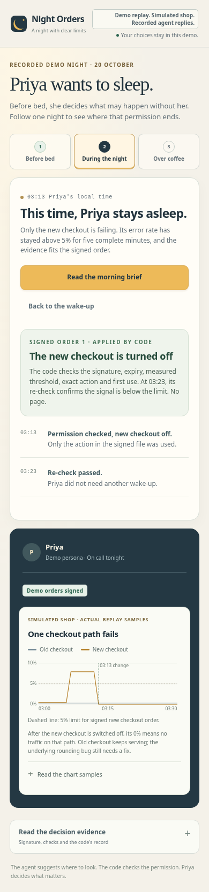
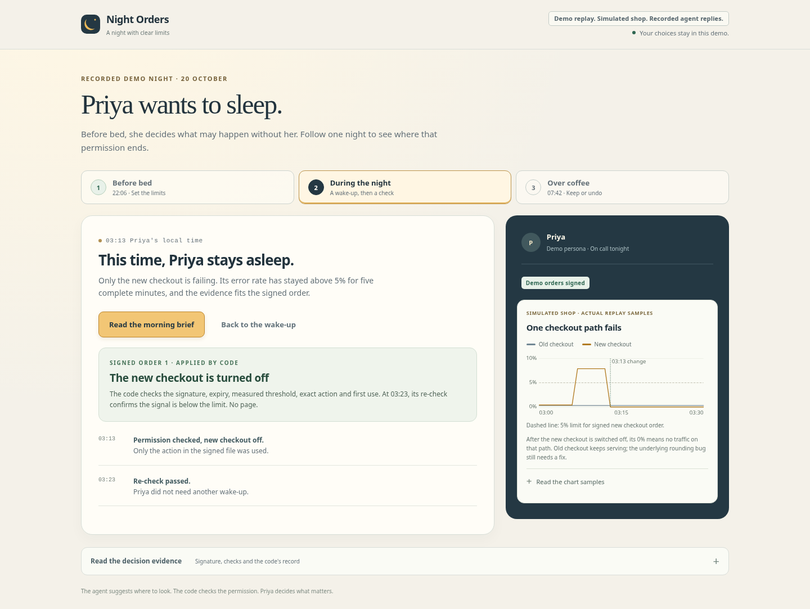

# Night Orders

**Before bed, you sign what the agent may do alone tonight. Everything else wakes you. The orders end at 07:00.**

For the engineer on call for a small team, an obvious reversible fix can still mean a broken night's sleep. Night Orders lets that person permit a few exact actions before bed, while keeping every other decision with them.

An entry for [Life After Code, the GitLab Transcend Hackathon](https://gitlab-transcend.devpost.com/), Path A. Built by Alex Velazquez. [MIT licence](LICENSE).

## Try one night in the browser

From the repository root, with Python 3.11 or newer and [uv](https://docs.astral.sh/uv/getting-started/installation/):

```sh
uv sync --locked
cd relay
uv run --project .. uvicorn main:app --host 127.0.0.1 --port 8080
```

Open **[http://localhost:8080/demo](http://localhost:8080/demo)** on a laptop or phone-sized browser window. No credentials are needed.

1. Review Priya's two orders, then choose **Sign demo orders** or **Leave unsigned**.
2. Both checkout paths fail. Read the three-line wake-up and choose **Approve demo fallback** or **Decline** when a suggestion is available.
3. Only the new checkout fails. See whether the signed order permits code to turn it off, and inspect the old and new checkout chart against the 5% limit.
4. Read the morning brief, the actual replay counts and the recorded keep-or-undo decision. Open **Read the decision evidence** for the signature, checks and ledger.

On the signed and approved path, code records **1 wake-up, 1 incident handled while Priya slept and 1 human-approved action**. These are counts from this invented night, not measured production impact. Try leaving the orders unsigned to see the same faults without permission to act.



*Local app screenshot. Demo persona, simulated shop, planted faults and recorded agent replies.*



*Local app screenshot. The chart displays samples returned by the replay, with a 5% limit for the signed new checkout order.*

**What is real:** each combination of demo choices is computed in isolated memory through the existing [Watch decision code](relay/nightorders/watch.py), including its recovery checks, ledger and morning countersign code. The four results are cached so repeat choices load quickly. The browser's buttons select recorded demo signatures and approvals. They do not merge a GitLab request, push code or send a phone notification. Each replay computation is bounded to 960 steps and 10 seconds.

**What is demo data:** Juniper Market, Priya, today's changes and both faults are invented. Model replies, signature, approval and morning merge are recorded fixtures. Metrics are computed from the simulated shop and its changing flags. See the [bundled fixture notes](relay/nightorders/demo_story_data/README.md) and [source demo night](demo/night-2026-10-20/README.md). No live model or production service is called by the browser demo.

## How permission works

The model chooses where to look. Code decides what is true. A human decides when the agent acts on anything that matters.

- **Before bed:** the dusk drafter proposes at most three orders from the day's changes. Each names a condition and one reversible action: set a feature flag, or move a Cloud Run service's traffic to a named earlier revision. A database migration gets no order.
- **Signature:** in the intended GitLab workflow, the on-call person's merge signs the orders. Unsigned orders grant no authority.
- **During the night:** both keys must agree. Code checks the signature, expiry, measured condition, exact permitted action and first use tonight. The watch reply must name the order and explain why it fits. The action comes from the signed file, never from free text in the reply or a log.
- **Outside the orders:** the engineer gets a short page and, when available, one suggestion requiring their approval. In the replay, both checkout paths failing causes the recorded watch reply to decline the new checkout order.
- **Over coffee:** authority ends at 07:00. Expiry does not automatically undo existing changes. The morning countersign decides what stays; code undoes overnight changes that are not kept. The default replay keeps the new checkout off and undoes the temporary inventory fallback.

Payment errors, a second alert during a re-check, expired permission, a malformed reply, a reply timeout and an exhausted nightly model budget cannot be covered by an order. The decision and watch loops enforce those limits in [code](relay/nightorders/).

## GitLab workflow and current limits

Status: **5 Oct 2026 (Pacific Time)**. The local application and offline decision workflow are available here, with **256 passing local tests**. A public live demo URL is **pending**. Nothing has run on GitLab.com or Google Cloud yet, and no live model execution has been demonstrated.

Three custom GitLab Duo Agent Platform flows are defined: [dusk](flows/dusk.yml) drafts orders, [watch](flows/watch.yml) reads incident evidence, and [dawn](flows/dawn.yml) proposes the morning countersign. Their files are validated against the checked-in GitLab flow schema and tool list. That validation checks configuration; it is not proof of a live Duo run.

The intended runtime connects those flows to the [FastAPI relay](relay/README.md), GitLab incidents, merge requests and feature flags, and Cloud Run. The relay's night start depends on a working GitLab Flows API integration. [Deployment code](deploy/README.md) uses GitLab CI and keyless Google Cloud authentication, but has not deployed this project. The [pipeline configuration](.gitlab-ci.yml) is present; visible running GitLab pipeline history is still pending.

The current browser improvement is one guided story through the existing core, with two human choices, measured simulated chart samples and inspectable evidence. It demonstrates the bounded permission workflow locally. It does not establish a deployed or operationally tested integration.

The submission is planned for Path A. **Supervised is the current category recommendation, pending a live end-to-end run and a final rules check.** Nightly human approval and morning review mean the Hands-off category should not be treated as settled. The [official rules](https://gitlab-transcend.devpost.com/rules) require actual GitLab Duo Agent Platform use.

## Evidence and submission materials

| Read | What it provides |
|---|---|
| [Judge guide](docs/GUIDE.md) | The five equally weighted criteria and the evidence for each |
| [Devpost draft](docs/DEVPOST.md) | An English submission draft with pending links and proof called out |
| [Video script](docs/VIDEO.md) | A filmable browser replay under three minutes |
| [Current status](docs/STATUS.md) | Verified progress and integration gaps |
| [Morning handoff](docs/MORNING.md) | The next concrete steps for Alex |
| [Rules check](docs/codex/RULES_CHECK.md) | Quoted primary-source requirements and dates |

## Optional command-line replay and checks

From the repository root:

```sh
uv sync --locked
uv run pytest -q
uv run python flows/validate.py
cd relay
uv run --project .. python -m nightorders.cli validate ../ops/night-orders.yml --ops ../ops
uv run --project .. python -m nightorders.demo_night ../demo/night-2026-10-20
```

The CLI uses the same labelled demo night and decision code. The separate gcloud flag audit in [deploy/tests/test_cli_flags.py](deploy/tests/test_cli_flags.py) requires the pinned Google Cloud SDK image configured in CI.

Source layout: [agent/](agent/) is the dusk drafter, [flows/](flows/) contains the Duo definitions, [ops/](ops/) sets targets and policy, [relay/](relay/) contains the decision core and app, [shop/](shop/) is the demo shop, and [deploy/](deploy/) contains deployment setup. The rules for agents building this repository are in [AGENTS.md](AGENTS.md).
